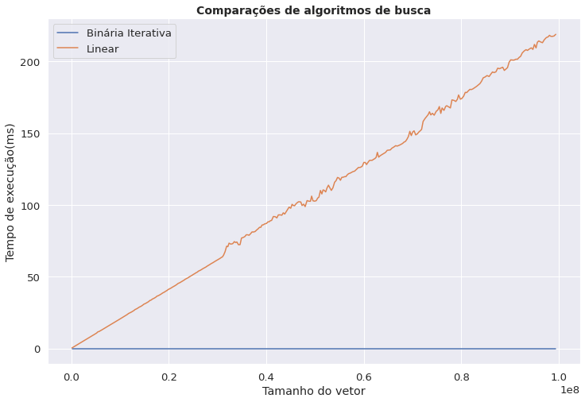
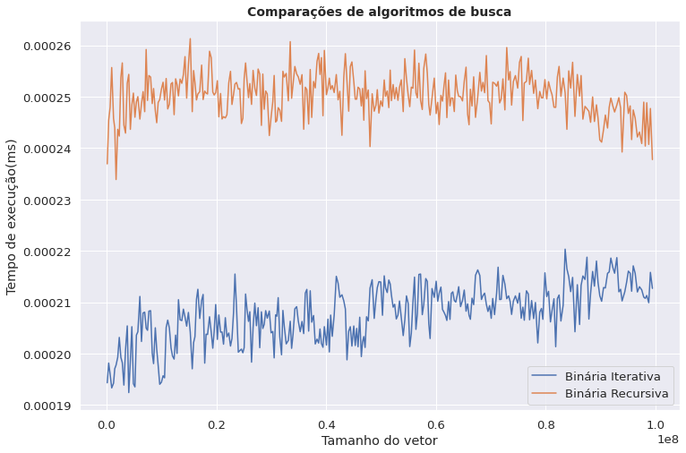

# Implementação de Algoritmos de Busca
> Relatório realizado durante a disciplina de Linguagem de Programação 1, na UFRN ministrada pelo docente Selan Rodrigues.

## Introdução

 A [análise de tempo de execução](https://en.wikipedia.org/wiki/Analysis_of_algorithms) é método que determina o aumento do tempo de execução de um algoritmo conforme o tamanho da entrada crescer. Programas que resolvem um mesmo problema podem levar segundos, horas ou até anos para terminar de serem executados, dependendo do algoritmmo implementado em cada um, por isso é importante este tipo de análise. 

Este projeto analizou três tipos de algoritmos de busca (Busca Linear,  Binária Iterativa e  Binária Recursiva) e analisou o tempo de excução de cada de cada um no pior caso. Os algoritmos foram construídos em `c++` e tiveram seu tempo mensurado utilizando a biblioteca [Chrono Library](https://en.cppreference.com/w/cpp/chrono) com vetores de diversos tamanhos, após isso esses dados foram analisados em `python` .

## Análise

### Contagem do tempo
Para contar o tempo foram criados de 10.000 até 100.000.000 de tamanho, icrementnado 20.000 o seu tamanho, esse vetores eram compostos apenas por 0 e buscava-se o número -1, ou seja, sempre realizava o pior caso dos dois tipos de algoritmos. Além disso o teste repetia-se 30 vezes no vetor do mesmo tamanho e o tempo dele era a média desses 30 valores.

#### Busca Linear X Busca Binária

Quando comparado com a busca binária, a busca linear é tão lenta que se torna um desafio encontrar uma representação gráfica para demonstrar essa diferença. Isso acontece justamente porque a buscar linear possui complexidade O(n) en quanto a busca binária possui complexidade O(log n).

#### Busca Binária Recursiva X Busca Binária Iterativa

Nessa gráfico percebemos que as buscas tem uma variação de tempo muito pequena a medida que o vetor aumenta, além disso a busca iterativa é sempre mais rápida que a busca recursiva, apesar das diferenças de tempo serem extremamente pequenas, essas constantes oscilações podem ter sido cousadas por fatores externos do próprio hardware e do sistema operacional.

### Correlação
Para verificar se o tamanho do vetor não está influenciando no tempo de execução das buscas binárias é necessário calcular o [Coeficiente de correlação de Pearson](https://pt.wikipedia.org/wiki/Coeficiente_de_correla%C3%A7%C3%A3o_de_Pearson), a tabela abaixo oferece esse coeficiente:

|  | Binária Iterativa |Binária Recursiva | Linear |
| --------------- | --------------- | --------------- | --------------- | 
| Tamanho do vetor | 0.038 |-0.012 | 0.999 |

Como a correlação das buscas binárias em módulo é menor que 0.1 pode-se afirmar que na busca binária o tamanho do vetor não influenciou no tempo de execução , isso ocorre porque as buscas binárias possuem complexidade O(log(n)) então seu tempo de execução cresce em uma escala muito menor que a buscar linear que tem complexidade O(n).
## Conclusões 
- Busca Binária é mais rápida que Busca Linear;
- Busca Binária Iterativa é melhor que Busca Binária Recursiva;
- Nas Buscas Binárias o tamanho do vetor não influenciou significativamente o tempo de execução;
- O tamanho os vetores não foram grandes o suficiente para observar variações nas Buscas Binárias.

